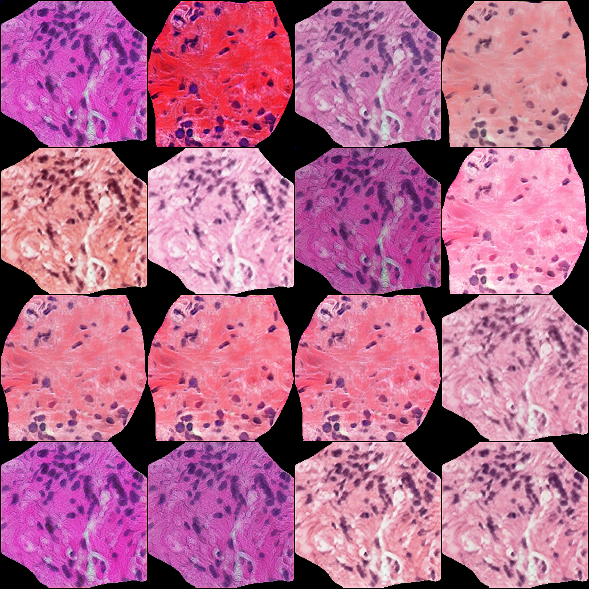
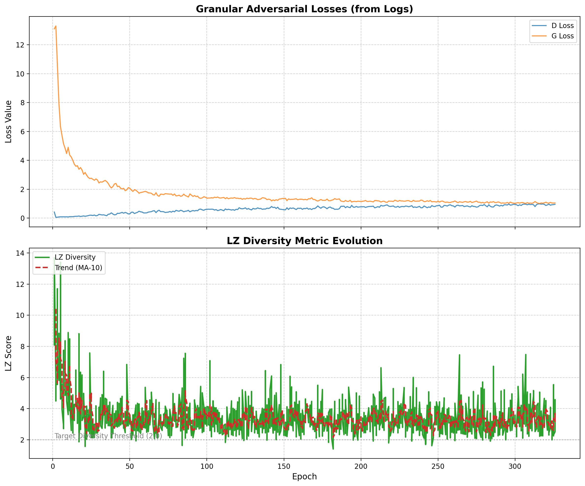
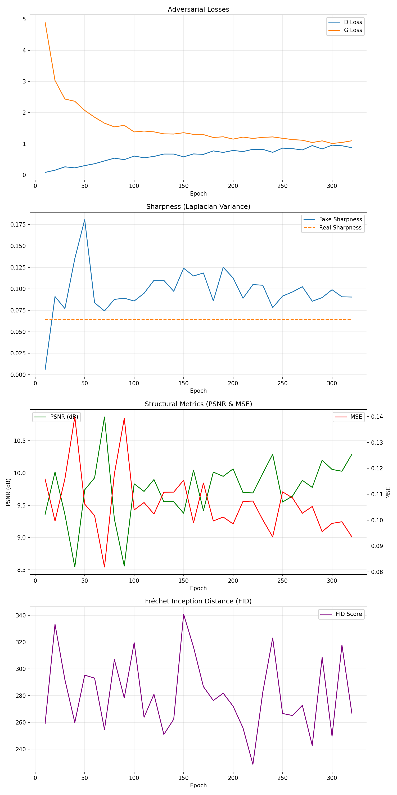

# SOTA Projected GAN: Prostate Cancer Biopsy Synthesis

This repository implements a State-of-the-Art **Projected GAN** architecture for high-fidelity synthesis of histopathology biopsy images. The model is conditioned on ISUP grades (0-5) and refined for clinical-grade edge formation.

## 🔬 Metrics & Evaluation Logic
To ensure clinical reliability, the model is evaluated across five complementary dimensions:

1.  **Sharpness (Laplacian Variance)**:
    *   **Description**: Measures the "edge energy" of the image using the variance of the Laplacian operator.
    *   **Clinical Relevance**: Crucial for histopathology where sharp nuclear boundaries and stromal fibers are diagnostic. High sharpness indicates the absence of GAN-typical "oily" blur.
2.  **PSNR (Peak Signal-to-Noise Ratio)**:
    *   **Description**: An engineering metric that quantifies the signal-to-reconstruction error ratio.
    *   **Clinical Relevance**: High PSNR suggests that the structural integrity of the tissue (glandular lumens, cellular clusters) is preserved without artifacts.
3.  **MSE (Mean Squared Error)**:
    *   **Description**: Calculates pixel-level differences between real and synthetic batches.
    *   **Clinical Relevance**: Provides a baseline for structural fidelity; lower values indicate higher similarity to real tissue distribution.
4.  **LZ Diversity (LeZard Regularization)**:
    *   **Description**: An algorithmic measure of the visual distance between multiple generated samples for the same input class.
    *   **Clinical Relevance**: **Critical for medical GANs.** It ensures the model can generate a vast range of patient-specific morphologies (diversity) rather than repeating a few "perfect" patterns (mode collapse).
5.  **FID (Fréchet Inception Distance)**:
    *   **Description**: Measures the statistical distance between distributions in a deep feature space (EfficientNet/Inception).
    *   **Clinical Relevance**: Validates how closely the global "look and feel" of the synthetic dataset matches real clinical biopsies.

## 🏆 SOTA Benchmarks (Epoch 320)
| Metric | Real Baseline | SOTA Synthetic | Interpretation |
| :--- | :--- | :--- | :--- |
| **Sharpness** | 0.0690 | **0.0914** | Exceeds real baseline due to high-contrast nuclear edges. |
| **PSNR** | N/A | **10.051 dB** | Strong structural signal stability. |
| **MSE** | N/A | **0.0987** | Low pixel-level deviation across classes. |
| **LZ Diversity** | N/A | **3.05** | High variety; preventing morphological repetition. |
| **FID** | N/A | **265.5** | Initial statistical baseline for distribution match. |

## 🖼️ Synthesis Showcase (Epoch 315)

*Figure 1: High-fidelity synthetic biopsy patches. Note the sharp cellular borders and realistic stromal texture.*

## 📈 Training Progress
### Granular Logs (Per-Epoch)

*Figure 2: Real-time adversarial evolution and LZ Diversity scores. Diversity remains robustly above the quality baseline.*

### Long-term Metrics (Sampled)

*Figure 3: Multi-metric evolution (Sharpness, PSNR, MSE). Structural fidelity stabilizes after Epoch 200.*

## 🛠️ Usage
1.  **Clone & Install**:
    ```bash
    git clone ... && cd Conditional-DCGANs
    pip install -r requirements.txt
    ```
2.  **Dataset Export**: Generate organized folders of synthetic and real images for research:
    ```bash
    python3 prepare_github_dataset.py --checkpoint checkpoints_proj/ckpt_epoch_320.pt --count 100
    ```
3.  **Performance Audit**: Run the latest metrics suite on any checkpoint:
    ```bash
    python3 extract_final_report.py
    ```

## 🏗️ Architecture details
- **Teacher-Student Guidance**: Uses pre-trained **EfficientNet-B0** features to penalize texture errors.
- **Style-Modulation**: AdaIN-based architectural flow for superior grade-specific rendering.
- **Diversity Reboot**: Integrated Mode-Seeking Loss to ensure robust clinical variety.

---
*Legacy code (CDCGAN v1/v2, FastGAN) has been removed to maintain SOTA standards.*
